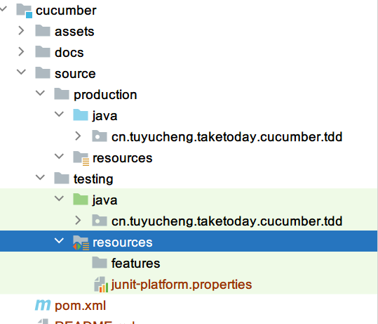
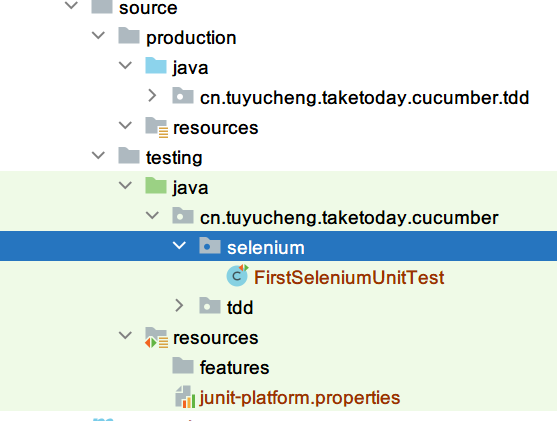
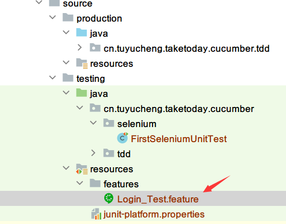
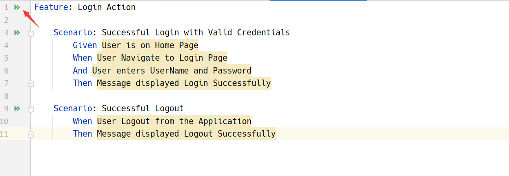
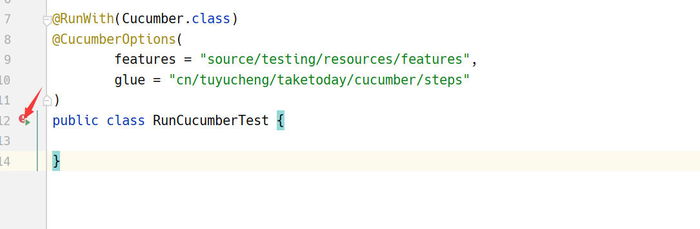
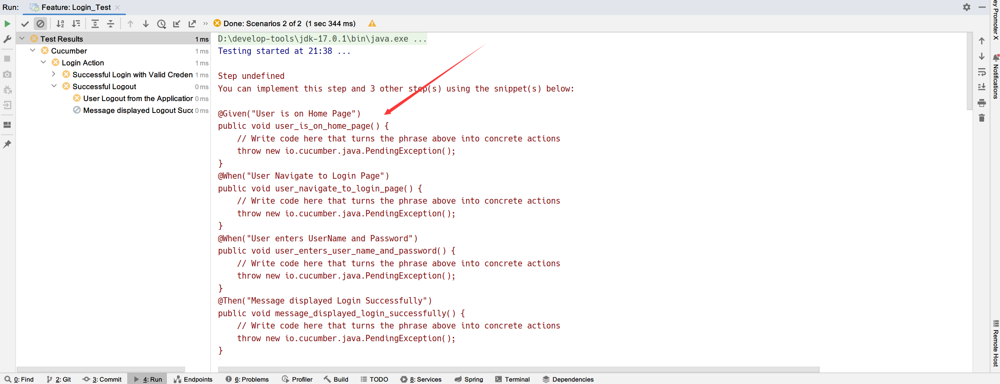
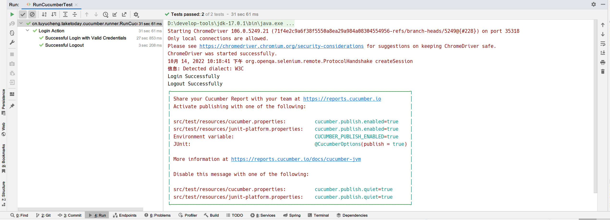
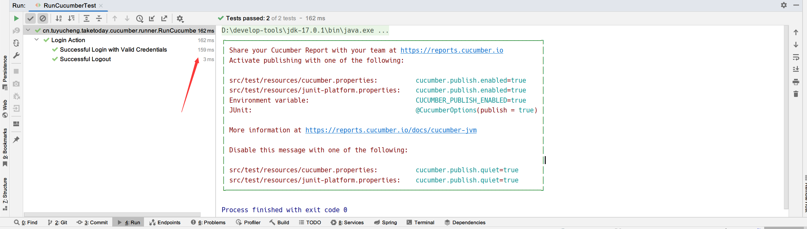
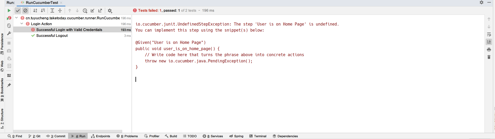

## 1. 概述

到目前为止，我们已经了解了什么是Cucumber以及它遵循的开发模式。现在让我们尝试创建第一个Cucumber Selenium Java测试，
假设你已经对Selenium WebDriver及其基本用法有一些基础的了解。

我希望你已经学习了完整的教程，并且我希望到目前为止你已经完成了以下步骤，这是编写Cucumber Selenium测试的先决条件：

1. 下载&安装Java。
2. 下载&安装Intellij IDEA。
3. 添加Cucumber依赖。
4. 下载Selenium WebDriver。

## 2. Maven依赖

```xml
<?xml version="1.0" encoding="UTF-8"?>
<project xmlns="http://maven.apache.org/POM/4.0.0"
         xmlns:xsi="http://www.w3.org/2001/XMLSchema-instance"
         xsi:schemaLocation="http://maven.apache.org/POM/4.0.0 http://maven.apache.org/xsd/maven-4.0.0.xsd">

    <modelVersion>4.0.0</modelVersion>
    <artifactId>cucumber</artifactId>
    <version>1.0.0</version>
    <name>cucumber</name>

    <parent>
        <groupId>cn.tuyucheng.taketoday</groupId>
        <artifactId>software-testing</artifactId>
        <version>1.0.0</version>
    </parent>

    <dependencies>
        <dependency>
            <groupId>io.cucumber</groupId>
            <artifactId>cucumber-java</artifactId>
            <version>${cucumber.version}</version>
        </dependency>
        <dependency>
            <groupId>net.masterthought</groupId>
            <artifactId>cucumber-reporting</artifactId>
            <version>${cucumber-reporting.version}</version>
        </dependency>
        <dependency>
            <groupId>io.cucumber</groupId>
            <artifactId>cucumber-jvm-deps</artifactId>
            <version>1.0.6</version>
        </dependency>
        <dependency>
            <groupId>io.cucumber</groupId>
            <artifactId>cucumber-junit-platform-engine</artifactId>
            <version>${cucumber.version}</version>
        </dependency>
        <dependency>
            <groupId>org.junit.platform</groupId>
            <artifactId>junit-platform-suite</artifactId>
            <version>${junit-platform.version}</version>
            <scope>test</scope>
        </dependency>
        <dependency>
            <groupId>org.junit.platform</groupId>
            <artifactId>junit-platform-console</artifactId>
            <version>${junit-platform.version}</version>
            <scope>test</scope>
        </dependency>
        <dependency>
            <groupId>com.fasterxml.jackson.core</groupId>
            <artifactId>jackson-databind</artifactId>
            <scope>test</scope>
        </dependency>
        <dependency>
            <groupId>org.seleniumhq.selenium</groupId>
            <artifactId>selenium-java</artifactId>
            <version>${selenium.version}</version>
        </dependency>
        <dependency>
            <groupId>org.seleniumhq.selenium</groupId>
            <artifactId>selenium-support</artifactId>
            <version>${selenium.version}</version>
        </dependency>
        <dependency>
            <groupId>io.github.bonigarcia</groupId>
            <artifactId>webdrivermanager</artifactId>
            <version>${webdrivermanager.version}</version>
            <scope>test</scope>
        </dependency>
    </dependencies>

    <properties>
        <cucumber.version>7.0.0</cucumber.version>
        <cucumber-reporting.version>5.4.0</cucumber-reporting.version>
        <selenium.version>3.141.59</selenium.version>
        <webdrivermanager.version>4.3.1</webdrivermanager.version>
    </properties>
</project>
```

## 3. 项目包结构

在开始编写第一个脚本之前，我们首先看看项目的包结构：



### 3.1 Selenium Java Test

让我们首先为登录功能编写一个简单的Java Selenium测试脚本，然后将该脚本转换为Cucumber脚本，以便更好地理解它。

新建一个名为selenium的包，在该包中新建一个FirstSeleniumTest测试类：



现在编写一个简单的脚本，在Selenium中执行以下步骤：

1. 启动浏览器
2. 导航到主页
3. 单击登录按钮
4. 输入用户名和密码
5. 单击提交按钮
6. 打印成功消息
7. 从应用程序注销
8. 打印成功消息
9. 关闭浏览器

```java
class FirstSeleniumUnitTest {

    @BeforeEach
    void setUp() {
        System.setProperty("webdriver.chrome.driver", "D:\\chromedriver.exe");
    }

    @Test
    void givenLoginPage_whenAccess_thenGetSomeElement() {
        // Create a new instance of the ChromeDriver.
        WebDriver driver = new ChromeDriver();

        // Put an Implicit wait, this means that any search for elements on the page 
        // could take the time the implicit wait is set for before throwing exception
        driver.manage().timeouts().implicitlyWait(10, TimeUnit.SECONDS);

        // Launch the Online Store Website
        driver.get("https://shop.demoqa.com");

        // Find the element that's linkText is 'Dismiss'(Dismiss) and 'My Account'(My Account).
        driver.findElement(By.linkText("Dismiss")).click();
        driver.findElement(By.linkText("My Account")).click();

        // Find the element that's ID attribute is 'username' (Username).
        // Enter Username on the element found by above desc.
        driver.findElement(By.id("username")).sendKeys("testuser_1");

        // Find the element that's ID attribute is 'password' (Password)
        // Enter Password on the element found by the above desc.
        driver.findElement(By.id("password")).sendKeys("Test@123");

        // Now submit the form. WebDriver will find the form for us from the element.
        driver.findElement(By.name("login")).click();

        // Print a Log In message to the screen.
        System.out.println("Login Successfully");

        // Find the element that's ID attribute is 'account_logout' (Log Out)
        driver.findElement(By.xpath("//*[text()='Checkout']")).click();

        // Print a Log In message to the screen.
        System.out.println("Logout Successfully");

        // Close the driver.
        driver.quit();
    }
}
```

要执行测试，只需在Intellij中右键选择Run 'FirstSeleniumUnitTest'，或者使用快捷键Ctrl+Shift+F10即可运行该测试脚本。
大约几秒钟后，你的Chrome浏览器将打开，在测试脚本的帮助下，Selenium将启动Online Store演示应用程序，并执行登录。

## 4. Cucumber Feature文件

Cucumber建议使用Given/When/Then格式编写Scenario。
在Cucumber Selenium Java测试的最后一节中，我们决定在shop.demoqa.com上使用登录场景。
在本章中，我们将用Cucumber格式(Feature文件)编写一个测试。

### 4.1 什么是Cucumber Feature文件

**Feature文件是Cucumber测试的入口点**。这是一个用描述性语言(如英语)描述测试的文件。
它是Cucumber的重要部分，因为它既是一个自动化测试脚本，也是一个实时文档。
一个Feature文件可以包含一个Scenario，也可以在一个Feature文件中包含多个Scenario，但它通常包含一个Scenario列表。让我们创建一个这样的文件：



为了让Cucumber自动检测Feature文件，你需要确保它们的文件扩展名为.feature。
例如在本例中，我将它命名为“LogIn_Test.feature”。每个“Feature”文件通常由单个功能组成。

编写第一个Cucumber脚本。在BDD术语中，Scenario如下所示：

```gherkin
Feature: Login Action

    Scenario: Successful Login with Valid Credentials
        Given User is on Home Page
        When User Navigate to Login Page
        And User enters UserName and Password
        Then Message displayed Login Successfully

    Scenario: Successful Logout
        When User Logout from the Application
        Then Message displayed Logout Successfully
```

注意：这是Cucumber中的一个简单测试。如果你不理解，不要担心语法。
理想情况下，你应该能够通过阅读Feature文件中的步骤语句来理解测试的意图，我们会在下一章更详细地讨论这一点。

### 4.2 关键字

现在，我们已经定义了一个测试。你会注意到测试的彩色部分(Feature、Scenario、Given、When、And、Then)，这些是由Gherkin定义的关键字。
Gherkin还有很多的关键词，我们将在接下来的教程中介绍。但首先，我们可以快速的解释一下这些关键字的意思：

|   关键字   |          含义           |
|:-------:|:---------------------:|
| Feature |    定义将在下面的测试中测试的功能    |
|  Given  |       说明测试的前提条件       |
|   And   |       定义测试的附加条件       |
|  Then   | 说明后置条件，你可以说这是测试的预期结果。 |

### 4.3 Gherkin

上面的一种语言叫做Gherkin，它实现了业务可读领域特定语言(BRDSL)的原则。特定于领域的语言使你能够描述应用程序的行为，而不必深入实现的细节。
这是什么意思？如果我们回顾TDD的教程，我们会看到我们在编写任何应用程序代码之前编写了测试代码。在某种程度上，我们描述了应用程序在测试方面的预期行为。
在TDD上，这些测试是纯Java测试，在你的例子中，这些测试可能是C++或C#测试。但基本思想是，这些都是核心技术测试。

回过头来，当我们使用BDD/BRDSL时能够以更可读的格式描述测试。在上面的测试中，仅仅通过阅读就可以很清楚地知道测试会做什么。
在作为测试的同时，它还记录了应用程序的行为。这是BDD/BRDSL的真正力量，它最终将成为Cucumber的力量，因为Cucumber的工作原理是相同的。

## 5. JUnit测试

现在我们已经定义了测试，是时候运行我们的测试了。但在此之前，我们必须添加一个用于运行测试的类。Cucumber使用JUnit框架运行。
当Cucumber使用JUnit时，我们需要一个Test Runner类。
这个类将使用JUnit的@RunWith()注解，它告诉JUnit使用哪个类作为测试Runner，就像是JUnit开始执行测试的起点。

### 5.1 JUnit Test Runner类

我们可以新建一个RunCucumberTest类，这个类只需要添加注解来通过它运行Cucumber，并且你可以指定要获取的Feature文件以及Step
Definition类的位置。
还可以配置其他一些参数，稍后将在Cucumber Options中讨论。

```java
import org.junit.runner.RunWith;
import io.cucumber.junit.Cucumber;
import io.cucumber.junit.CucumberOptions;

@RunWith(Cucumber.class)
@CucumberOptions(
        features = "source/testing/resources/features",
        glue = "cn/tuyucheng/taketoday/cucumber/steps"
)
public class RunCucumberTest {

}
```

### 5.2 import语句

@RunWith注解告诉JUnit应该使用Cucumber类来运行测试。

第二个注解@CucumbelOptions告诉Cucumber在哪里查找Feature文件、使用什么报告系统等等。
在上面的测试中，我们指定了Feature文件所在的目录，以及Step Definition类所在的包。

### 5.3 运行Cucumber测试

在Intellij IDEA中，你可以运行RunCucumberTest类，也可以直接运行feature文件：



--------------------------------------------------------------------------------------------------------------------------



你可能会想，执行这些测试的java代码在哪里？嗯，现在不用担心这个。当我们运行Cucumber测试的时候，可以在控制台看到一些关键信息。
Cucumber给出了建议的实现方式，这样Feature文件中提到的步骤就可以追溯到Java的方法，这些方法可以在执行Feature文件时执行：



我们的下一个目标是测试或运行Feature文件，为了测试Feature文件，
我们需要用java为Feature文件中的每个步骤编写实现或步骤定义(Step Definition)。
当Cucumber在Scenario中执行步骤时，它将查找要执行的匹配的Step Definition方法。

## 6. 什么是Step Definition？

Step Definition是带有模式的一小段代码，或者换句话说，Step Definition是类中的java方法，方法上面带有注解。
模式后面的注解用于将步骤定义链接到所有匹配的步骤，代码是Cucumber在看到Gherkin步骤时将执行的代码。
Cucumber通过CucumberOptions中的“glue”属性找到Step Definition类。

### 6.1 添加Step Definition类

在RunCucumberTest类中，我们定义了@CucumberOptions注解的“glue”属性值为“cn/tuyucheng/taketoday/cucumber/steps”，
这正是我们的Step Definition类所在的包，因此我们可以在该包下新建一个LoginSteps类：

```java
public class LoginSteps {

}
```

回顾我们之前所提到的，当我们运行Cucumber测试时控制台给出了简单的步骤实现，因此我们首先可以直接将这些代码复制到我们的LoginSteps类中：

```java
public class LoginSteps {

    @Given("User is on Home Page")
    public void user_is_on_home_page() {
        // Write code here that turns the phrase above into concrete actions
        throw new io.cucumber.java.PendingException();
    }

    @When("User Navigate to Login Page")
    public void user_navigate_to_login_page() {
        // Write code here that turns the phrase above into concrete actions
        throw new io.cucumber.java.PendingException();
    }

    @When("User enters UserName and Password")
    public void user_enters_user_name_and_password() {
        // Write code here that turns the phrase above into concrete actions
        throw new io.cucumber.java.PendingException();
    }

    @Then("Message displayed Login Successfully")
    public void message_displayed_login_successfully() {
        // Write code here that turns the phrase above into concrete actions
        throw new io.cucumber.java.PendingException();
    }

    @When("User Logout from the Application")
    public void user_logout_from_the_application() {
        // Write code here that turns the phrase above into concrete actions
        throw new io.cucumber.java.PendingException();
    }

    @Then("Message displayed Logout Successfully")
    public void message_displayed_logout_successfully() {
        // Write code here that turns the phrase above into concrete actions
        throw new io.cucumber.java.PendingException();
    }
}
```

### 6.2 在Step Definition方法中添加Selenium Java代码

现在从FirstSeleniumTest中提取以下步骤的Selenium Java代码，并将其粘贴到第一个方法“@Given("User is on Home Page")”中：

+ 启动浏览器
+ 导航到主页

此时的“@Given("User is on Home Page")”方法如下所示：

```text
@Given("User is on Home Page")
public void user_is_on_home_page() {
    driver = new ChromeDriver();
    driver.manage().timeouts().implicitlyWait(10, TimeUnit.SECONDS);
    driver.get("https://shop.demoqa.com");
}
```

从FirstSeleniumTest中提取以下步骤的Selenium Java代码，粘贴到第二个方法“@When("User Navigate to Login Page")”中：

+ 单击Dismiss
+ 单击“My Account”链接

此时的“@When("User Navigate to Login Page")”方法如下所示：

```text
@When("User Navigate to Login Page")
public void user_navigate_to_login_page() {
    driver.findElement(By.linkText("Dismiss")).click();
    driver.findElement(By.linkText("My Account")).click();
}
```

从FirstSeleniumTest中提取以下步骤的Selenium Java代码，粘贴到第三个方法“@When("User enters UserName and Password")”中：

+ 输入用户名和密码
+ 点击提交按钮

此时的“@When("User enters UserName and Password")”方法如下所示：

```text
@When("User enters UserName and Password")
public void user_enters_user_name_and_password() {
    driver.findElement(By.id("username")).sendKeys("testuser_1");
    driver.findElement(By.id("password")).sendKeys("Test@123");
    driver.findElement(By.name("login")).click();
}
```

对其余方法也执行相同的步骤，完整的LoginSteps类如下所示：

```java
public class LoginSteps {

    private static WebDriver driver;

    @Before
    public static void setUp() {
        System.setProperty("webdriver.chrome.driver", "D:\\chromedriver.exe");
    }

    @Given("User is on Home Page")
    public void user_is_on_home_page() {
        driver = new ChromeDriver();
        driver.manage().timeouts().implicitlyWait(10, TimeUnit.SECONDS);
        driver.get("https://shop.demoqa.com");
    }

    @When("User Navigate to Login Page")
    public void user_navigate_to_login_page() {
        driver.findElement(By.linkText("Dismiss")).click();
        driver.findElement(By.linkText("My Account")).click();
    }

    @When("User enters UserName and Password")
    public void user_enters_user_name_and_password() {
        driver.findElement(By.id("username")).sendKeys("tuyucheng");
        driver.findElement(By.id("password")).sendKeys("tuyucheng2000@163.com");
        driver.findElement(By.name("login")).click();
    }

    @Then("Message displayed Login Successfully")
    public void message_displayed_login_successfully() {
        System.out.println("Login Successfully");
    }

    @When("User Logout from the Application")
    public void user_logout_from_the_application() {
        driver.findElement(By.xpath("//*[text()='Checkout']")).click();
    }

    @Then("Message displayed Logout Successfully")
    public void message_displayed_logout_successfully() {
        System.out.println("Logout Successfully");
    }

    @AfterAll
    static void afterAll() {
        driver.quit();
    }
}
```

**注意**：确保为测试创建你自己的用户名和密码，并且不要尝试使用错误的密码登录，否则你的IP将被网站拉入黑名单几小时。

### 6.3 运行Cucumber测试

现在，我们可以运行我们的Cucumber Feature文件，并且在控制台中，我们会看到类似如下的输出：



Cucumber通过读取Feature文件中的步骤定义开始执行。
一旦Cucumber执行到第一步，例如Given语句，它会在Step Definition类中查找相同的语句对应的方法，一旦找到该方法，它就会执行方法内部编写的代码。

## 7. Gherkin关键字

Gherkin不一定用于编写自动化测试。Gherkin主要用于编写结构化测试，以后可以用作项目文档。结构化的特性使我们能够将它们自动化。
这种自动化是由Cucumber/SpecFlow完成的。

**注意**：Cucumber/SpecFlow理解Gherkin，因此我们可以说这是Cucumber/SpecFlow测试。

```gherkin
Feature: LogIn Action Test

    Description: This feature will test a LogIn and LogOut functionality

    Scenario: Successful Login with Valid Credentials
        Given User is on Home Page
        When User Navigate to Login Page
        And User enters UserName and Password
        Then Message displayed Login Successfully
```

在上面的Feature文件中，有一些语法高亮的词汇，这些是Gherkin的关键字，每个关键字都有一个含义。
现在我们会逐个讨论这些关键字，以下是Gherkin支持的关键字列表：

+ `Feature`
+ `Rule`
+ `Background`
+ `Scenario`
+ `Scenario Outline`
+ `Given`
+ `When`
+ `Then`
+ `And`
+ `But`
+ `*`

### 7.1 Feature关键字

每个Gherkin文件都以Feature关键字开头。Feature定义了你将在此Feature文件中测试的逻辑功能。
例如，如果你正在测试支付网关，则你的Feature将成为支付网关，或者如果你正在测试登录功能，则该Feature将成为登录。
拥有一个Feature文件的想法是总结你将要测试的内容。这将作为你测试的文档，也是新团队成员的良好起点。

请注意，Feature关键字出现在Feature文件的开头：

```gherkin
Feature: LogIn Action Test
```

或者：

```gherkin
Feature: LogIn Action Test

    Description: This feature will test a LogIn and LogOut functionality
```

或者：

```gherkin
Feature: LogIn Action Test

    This feature will test a LogIn and LogOut functionality
```

Feature关键字之后的任何内容都将被视为功能描述。如上第二个示例所示，功能描述可以占多行。
**Feature关键字之后的所有内容：直到遇到下一个关键字都被视为功能描述**。并且注意Description不是Gherkin的关键字。

### 7.2 Rule关键字

Cucumber 6.x版本中引入了Rule关键字来表示业务规则的实现。Rule旨在涵盖解释特定规则的一个或多个场景。
要解释Rule关键字的用法，请按照以下示例进行操作。考虑OTP生成的特性，其中规则之一是，如果帐户用户选择退出2000卢比以下交易的双因素身份验证，则不会生成OTP。

```gherkin
Feature: OTP generation test

    Rule: OTP is not generated if the account user has opted out of two-factor authentication for transactions below INR 2000

        Scenario: For an amount lesser than INR 2000, if the account user has opted out of the two-factor authentication, an OTP must not be generated

        Scenario: For an amount greater than INR 2000, if the account user has opted out of the two-factor authentication, an OTP must be generated

#        Scenario Outline: If the account user has not opted out of two-factor authentication, an OTP must be generated regardless of the amount.
```

注意：上面示例中概述的最后一个场景可以通过添加大量amount作为测试示例来支持。

### 7.3 Background关键字

Background关键字用于定义Feature文件中所有测试通用的步骤。例如，对于购买产品的业务，一般需要执行以下步骤：

+ 导航到主页
+ 单击登录链接
+ 输入用户名和密码
+ 点击提交按钮

只有在完成这些步骤之后，你才能将产品添加到你的购物车并能够执行付款。现在，假设我们在一个Feature文件中只测试“添加到购物车”这个功能，因此这些测试对于所有测试都是通用的。
因此，我们可以将这些步骤移动到Background关键字下，而不是为所有测试一次又一次地编写它们。以下是Background关键字的使用示例：

```gherkin
Feature: Add to Cart
    This feature will test functionality of adding different products to the User basket from different flow

    Background: User is Logged In

    Scenario: Search a product and add the first result/product to the User basket
        Given User searched for Lenovo Laptop
        When Add the first laptop that appears in the search result to the basket
        Then User basket should display with 1 item
```

### 7.4 Scenario关键字

每个Feature文件都将包含许多测试来测试该功能。每个测试都称为一个场景，并使用Scenario关键字进行描述：

```gherkin
Feature: Add to Cart

    Scenario: Search a product and add the first result/product to the User basket
```

或者：

```gherkin
Feature: LogIn Action Test

    Scenario: Successful Login with Valid Credentials
```

一个场景相当于我们常规开发过程中的一个测试方法。每个场景/测试基本上可以分为三个部分：

+ 测试的前提条件，用(Given)关键字表示。
+ 测试步骤执行，用(When)关键字表示。
+ 通过预期结果验证输出，用(Then)关键字表示。

### 7.5 Scenario Outline关键字

在想要使用不同的值或参数组合执行同一个Scenario的情况下，可以使用Scenario Outline。
它有助于使用多个参数对同一Scenario进行测试。针对同一Scenario Outline传递的多个参数称为Examples，这是Cucumber中的另一个关键字。
我们借助以下示例了解有关这两个关键字的更多信息。

考虑测试中的应用程序是交付应用程序的场景，此应用程序确定特定城市是否可以交付。
该功能的规则是，只有一个国家的首都城市才有资格选择Regular作为交付类型。对于所有其他城市，客户必须选择Premium作为交付类型。

```gherkin
Feature: Delivery Application - delivery type selection

    Rule: Only capital cities of a country are eligible for regular delivery of automobile spare parts.
    For all other cities, customers must select premium as the delivery type.

        Scenario Outline: The delivery type of automobile spare parts is dependent on the destination city of delivery.
            Given User is raising a delivery request for automobile spare parts
            When User enters the <"city">, a <"delivery type"> is set as a system default
            Then User submits delivery request
            Examples:
                | city    | delivery type |
                | Athens  | Regular       |
                | Delhi   | Regular       |
                | Kolkata | Premium       |
                | Houston | Premium       |
```

### 7.6 Given关键字

Given定义了测试的前提条件。例如在购物网站中，假设登录页面链接只出现在网站的首页，那么点击登录链接的前提是用户当前在首页。
如果用户不在主页，则用户将无法输入用户名和密码。这个前提条件在Gherkin中可以这样表达：

```gherkin
Feature: Login Action Test

    Scenario: Successful Login with Valid Credentials
        Given User is on Home Page
        When User Navigate to Login Page
```

### 7.7 When关键字

When关键字定义将被执行的测试操作。测试操作是指用户输入操作。

```gherkin
Feature: Login Action Test

    Scenario: Successful Login with Valid Credentials
        Given User is on Home Page
        When User Navigate to Login Page
```

在这里，用户使用When关键字执行一些操作，单击Login链接。我们可以看到When定义了用户采取的动作，该事件将导致应用程序状态的实际变化。

### 7.8 Then关键字

Then关键字定义了前面步骤的结果，我们可以在上面的例子中添加一个Then语句：

```gherkin
Feature: Login Action Test

    Description: This feature will test a Login and Logout functionality

    Scenario: Successful Login with Valid Credentials
        Given User is on Home Page
        When User Navigate to Login Page
        And User enters UserName and Password
        Then Message displayed Login Successfully
```

在这里我们可以看出，Then是上述步骤的结果，当Then之前的步骤满足条件时，将执行Then步骤。

### 7.9 And关键字

And关键字用于为你的步骤添加条件。让我们稍微修改一下我们的例子来看看它的用法：

```gherkin
Feature: Login Action Test

    Description: This feature will test a Login and Logout functionality

    Scenario: Successful Login with Valid Credentials
        Given User is on Home Page
        And Login Link displayed
        When User Navigate to Login Page
        And User enters UserName and Password
        Then Message displayed Login Successfully
        And Logout Link displayed
```

在这里，可以看到And被用于向Given步骤添加更多细节，它只是添加更多条件。
我们在这里添加了三个条件。当你指定了多个条件时可以使用它。And用于向Given、When和Then语句添加更多条件。

### 7.10 But关键字

But关键字用于表示否定，这不是硬性规定，但仅适用于否定条件。
使用它是有意义的，当你尝试添加一个与你的测试目的设置的前提相反的条件时：

```gherkin
Feature: Login Action Test

    Description: This feature will test a Login and Logout functionality

    Scenario: Unsuccessful Login with InValid Credentials
        Given User is on Home Page
        When User Navigate to Login Page
        And User enters UserName and Password
        But The user credentials are wrong
        Then Message displayed Wrong UserName & Password
```

在这个测试中，我们尝试测试失败的条件，例如错误的密码是导致测试失败的一种情况。

### 7.11 “*”关键字

这个关键字很特别。它违背了使用Given、When、Then和所有其他关键字的全部目的。
基本上，Cucumber并不关心你使用什么关键字来定义测试步骤，它只关心每个步骤需要执行什么代码，该代码称为Step Definition。
因此所有的关键字都可以被“*”关键字替换。

举个例子，对于之前登录行为的测试，我们可以使用“*”关键字来重写：

```gherkin
Feature: Login Action Test

    Description: This feature will test a Login and Logout functionality

    Scenario: Successful Login with Valid Credentials
        * User is on Home Page
        * User Navigate to Login Page
        * User enters UserName and Password
        * Message displayed Login Successfully
```

## 8. Cucumber Options

到目前为止，我们已经介绍了Feature文件、Gherkins、Step Definition、Annotations、测试Runner类和许多其他内容。
毫无疑问，在你了解所有概念之前，你不能百分百正确的使用BDD框架，但是在Cucumber自动化的生命周期中，
仍然有一些非常重要的领域需要了解，如Cucumber Options、正则表达式、页面对象工厂等。在本节中，我们重点介绍Cucumber Options。

### 8.1 什么是Cucumber Options？

用通俗的话说，@CucumberOptions就像是测试的属性文件或者配置。基本上，@CucumberOptions使我们能够完成使用Cucumber命令行时可以完成的所有事情。
如果我们只使用Intellij IDEA这样的IDE来运行我们的项目，这是非常有帮助的，也是最重要的。还记得我们RunCucumberTest类上的@CucumberOptions注解吗？

```java

@RunWith(Cucumber.class)
@CucumberOptions(
        features = "source/testing/resources/features",
        glue = "cn/tuyucheng/taketoday/cucumber/steps"
)
public class RunCucumberTest {

}
```

所以在上面的例子中，我们设置了两个不同的Cucumber Option。一个是Feature文件的位置，另一个是Step Definition类的位置。

Cucumber中有以下主要参数可供配置：

|    属性名     |                 描述                 |  默认值  |
|:----------:|:----------------------------------:|:-----:|
|   dryRun   | true：检查是否所有的步骤都有对应的Step Definition | false |
|  features  |          set：Feature文件的路径          |  {}   |
|    glue    |      set：Step Definition类的路径       |  {}   |
|    tags    |    instruct：应该执行Feature文件中的哪些标签    |  {}   |
| monochrome |       true：以更具可读性的方式显示控制台输出        | false |
|   format   |            set：报告使用的格式             | false |
|   strict   |      true：如果存在未定义或代办的步骤，则执行失败      | false |

### 8.2 dryRun

dryRun参数可以设置为true或false。如果设置为true，
则意味着Cucumber将只检查Feature文件中提到的每个步骤是否在Step Definition类中写入了相应的代码。
因此，如果Feature文件中任何步骤缺少对应的Step Definition方法，它会为我们给出提示信息。
要使用此参数，只需在@CucumberOptions注解中添加“dryRun=true”参数配置：

```java

@RunWith(Cucumber.class)
@CucumberOptions(
        features = "source/testing/resources/features",
        glue = "cn/tuyucheng/taketoday/cucumber/steps",
        dryRun = true
)
public class RunCucumberTest {

}
```

当我们运行Cucumber测试时：



从测试的执行时间和控制台没有输出相应的语句我们可以肯定，事实上没有真正执行任何步骤，
但Cucumber仍然会确保每个步骤在Step Definition类中都有相应的可用方法。
尝试一下，从LoginSteps类中删除“@Given("User is on Home Page")”方法，然后再次运行RunCucumberTest类。
在控制台中会包含以下内容：



### 8.3 Monochrome

此参数可以设置为true或false。如果设置为true，则意味着Cucumber测试的控制台输出更有可读性。
要使用此参数，只需在@CucumberOptions注解中添加“monochrome = true”参数配置：

```java

@RunWith(Cucumber.class)
@CucumberOptions(
        features = "source/testing/resources/features",
        glue = "cn/tuyucheng/taketoday/cucumber/steps",
        monochrome = true
)
public class RunCucumberTest {

}
```

### 8.4 features

features参数用于Cucumber在项目文件目录中定位Feature文件。
从最开始，我们就指定了features参数。我们所需要做的就是指定Feature文件所在文件夹的路径，然后Cucumber会自动找到该文件夹下的所有Feature文件：

```java

@RunWith(Cucumber.class)
@CucumberOptions(
        features = "source/testing/resources/features",
        glue = "cn/tuyucheng/taketoday/cucumber/steps"
)
public class RunCucumberTest {

}
```

### 8.5 glue

它与features参数相似，它的作用是指定Step Definitions类所在的包名。
每当Cucumber执行到一个步骤时，它就会在glue参数指定的包中的所有文件中查找Step Definition：

```java

@RunWith(Cucumber.class)
@CucumberOptions(
        features = "source/testing/resources/features",
        glue = "cn/tuyucheng/taketoday/cucumber/steps"
)
public class RunCucumberTest {

}
```

### 8.6 format

format参数用于为输出报告指定不同的格式化选项。其中可配置的值包含：

+ Pretty：打印带有额外颜色和堆栈跟踪错误的Cucumber源代码。使用方式为：format = {"pretty"}。
+ HTML：这将在for-matter本身提到的位置生成一个HTML报告。使用方式为：format = {"html:Folder_Name"}。
+ JSON：该报告以JSON格式包含来自Cucumber的所有信息。该报告将由Cucumber Jenkins等第三方工具后处理为另一种可视化格式。
  使用方式为：{"json:Folder_Name/cucumber.json"}。
+ JUnit：该报告生成XML文件，就像JUnit中的测试报告文件一样。大多数持续集成服务器都能理解这种XML格式，并使用它生成可视化报告。
  使用方式为：format = { "junit:Folder_Name/cucumber.xml"}。
