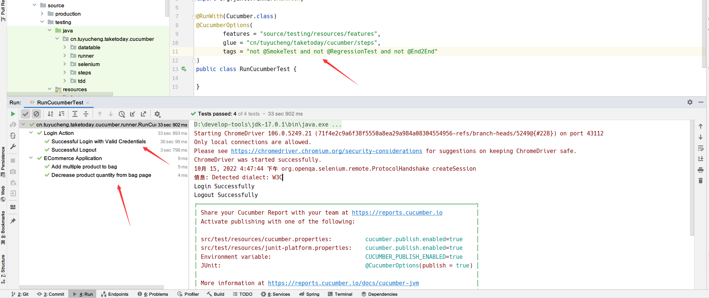

## 1. 概述

到目前为止，我们的Cucumber测试非常简单，因为在我们的Feature文件中只有几个场景。
但是，当你处理任何实际项目时，一个Feature文件中会包含许多场景，并且可能包含更多的Feature文件。
我们倾向于为应用程序中的每个其他特性或功能创建一个单独的Feature文件。
并将所有相关场景保存在同一个Feature文件中，这就是我们最终在其中包含许多场景的原因。每个场景都有它自己的先决条件。
为了处理来自不同Feature文件中的一些场景，Cucumber为我们提供了许多有用的功能：

+ Tags
+ Hooks
+ Tagged Hooks
+ Execution Order of Hooks
+ Background

## 2. Cucumber Tags

在我们将每个Feature和它下面的所有场景一起运行之前，一切都能正常的工作，并且很简单。
但是，如果你不想同时运行一个Feature文件中的所有场景，并且希望同时运行来自不同Feature文件的一些特定场景，该怎么办呢。
在本节中，我们将介绍以下内容：

+ 什么是Cucumber Tags？
+ 如何使用Tags分组运行Cucumber测试
+ 如何忽略Cucumber测试
+ 逻辑与和逻辑或Tags

### 2.1 什么是Cucumber Tags？

假设你有许多不同的Feature文件，涵盖了应用程序的所有不同功能。
现在，在项目中可能会出现某种情况，你只想执行SmokeTests或End2EndTests，或者可能是RegressionTests。
一种方法是创建新的Feature文件，其名称类似于SmokeTests.feature或End2EndTests.feature，并将现有测试的步骤定义复制到其中。
但这将污染我们的项目代码，并在未来需要更多的维护。那么在这种情况下如何管理执行呢？

为此，Cucumber提供了一种通过使用Feature文件中的标签来组织场景执行的方法。我们可以用一个有用的标签来定义每个场景。
然后，在JUnit Runner类中，我们可以决定Cucumber执行哪个特定标签(以及场景)。
标签以“@”开头，在“@”之后，你可以使用任何有意义的文本来定义你的标签，如@SmokeTest。
然后，要针对@SmokeTest标签运行测试，只需在CucumberOptions中指定tags=“@SmokeTest”。

标签不仅适用于Scenario，也适用于Feature，意味着你还可以标记Feature关键字。
**Feature上存在的任何标签都将由Scenario、Scenario Outline或Examples继承**。

### 2.2 如何使用标签进行分组Cucumber测试？

让我们用一个例子来理解这一点，以下是包含单个Feature场景列表的excel表：


**注意点**：

+ 冒烟测试、回归测试和端到端测试中包含的场景很少。
+ 少数场景是两个或更多测试类型的一部分。例如，第一个测试被视为SmokeTest和RegressionTest。
+ 少数场景根本没有标签。
+ Payment declined之后为一个场景，但有五组不同的测试数据。因此，这将被视为五种不同的场景。

对应的Feature文件如下所示：

```gherkin
@FunctionalTest
Feature: ECommerce Application

    @SmokeTest
    @RegressionTest
    Scenario: Successful Login
        Given This is a blank test

    @RegressionTest
    Scenario: UnSuccessful Login
        Given This is a blank test

    @SmokeTest
    Scenario: Add a product to bag
        Given This is a blank test

    Scenario: Add multiple product to bag
        Given This is a blank test

    @SmokeTest
    @RegressionTest
    Scenario: Remove a product from bag
        Given This is a blank test

    @RegressionTest
    Scenario: Remove all products from bag
        Given This is a blank test

    @SmokeTest
    Scenario: product quantity from bag page
        Given This is a blank test

    @SmokeTest
    Scenario: Increase product quantity from bag page
        Given This is a blank test

    Scenario: Decrease product quantity from bag page
        Given This is a blank test

    @SmokeTest
    @End2End
    Scenario: Buy a product with cash payment
        Given This is a blank test

    @SmokeTest
    @End2End
    Scenario: Buy a product with CC payment
        Given This is a blank test

    @End2End
    Scenario Outline: Payment declined
        Given This is a blank test
        Examples:
            | PaymentMethod |
            | CC Card       |
            | DD Card       |
            | Bank Transfer |
            | PayPal        |
            | Cash          |
```

--------------------------------------------------------------------------------------------------------------------------------------

**执行所有标记为@SmokeTest的测试**：


在我们的Feature文件中，使用@SmokeTest标记的场景包含6个，因此在JUnit运行窗口中只有6个场景被执行。

**执行标记为@End2End的所有测试**：


**注意**：这里需要特别注意的是，最后一个场景“Payment declined”有五组不同的数据，因此每组数据都被视为单独的测试，因此会执行7次。

**执行标记为@FunctionalTest的所有测试**：

标签不仅适用于Scenario，也可用于Feature文件中的Feature关键字上。上面的Feature文件被标记为@FunctionTest，让我们看看如何执行此Feature文件中的所有测试。


**注意**：这将执行Feature文件中存在的所有测试。

### 2.3 逻辑与和逻辑或

需求是复杂的，它并不总是像执行单个标签那样简单。它可能很复杂，就像执行标记为@SmokeTest或@RegressionTest的场景一样。
它也可以类似于执行同时标记为@SmokeTest和@RegressionTest的场景。Cucumber允许我们选择我们想要执行的标签。

**执行标记为@SmokeTest或@RegressionTest的所有测试**：


**注意**：or表示执行标记为@SmokeTest或@RegressionTest的场景。

**执行所有标记为@SmokeTest和@RegressionTest的测试**：


**注意**：在我们的Feature文件中，只有两个场景同时具有这两个标签。

### 2.4 如何忽略Cucumber测试

这是Cucumber标签的另一个特性，你甚至可以在组执行中跳过测试。
字符not用于跳过标签，这也适用于Scenario和Feature，也可以与and或or结合使用。

**执行标记为@FunctionalTest功能的所有测试，但跳过标记为@SmokeTest的场景**：


一共包含15个测试，而标记为@SmokeTest的测试为6个，因此在这里总共执行了9个测试。

**执行Feature中不包含指定标签的所有测试**：



在我们的项目中，Login_Test.feature中的场景均不包含标签，因此其中的测试全部执行，而Tags_Test.feature中只有两个场景不包含标签，因此只有两个测试被执行。

**执行单个Feature中不包含指定标签的所有测试**：


## 3. Cucumber Hooks

### 3.1 Cucumber中的钩子是什么

Cucumber支持钩子，钩子是在每个场景之前或之后运行的代码块，简单的说，它类似于JUnit中的@Before和@After注解。
你可以使用@Before和@After方法在项目或Step Definition类中的任何位置定义它们。
Cucumber Hooks允许我们更好地管理代码工作流，并帮助我们减少代码冗余。我们可以认为这是一个看不见的步骤，它允许我们执行场景或测试。

### 3.2 为什么需要钩子

在实际的测试中，你一定遇到过需要在测试任何场景之前执行先决条件步骤的情况。这个先决条件可以是：

+ 启动一个WebDriver
+ 建立DB连接
+ 设置测试数据
+ 设置浏览器Cookie
+ 导航到特定页面
+ 或者需要在测试前所做的任何事情

同样的，也有一些常见的需要在测试任何场景之后执行的步骤，比如:

+ 关闭WebDriver
+ 关闭数据库连接
+ 清除测试数据
+ 清理浏览器cookie
+ 从应用程序注销
+ 打印报告或日志
+ 截图错误
+ 或者需要在测试后所做的任何事情

要处理这类情况，Cucumber中的钩子是最好的选择。
与JUnit中的注解不同，Cucumber只支持两个钩子(@Before和@After)，分别在测试场景的开始和结束时执行。
顾名思义，@Before钩子在任何其他测试场景之前执行，而@After钩子在任何场景执行之后执行。

### 3.3 单个场景测试钩子

**Feature文件**：

```gherkin
Feature: Test Hooks

    Scenario: This scenario is to test hooks functionality
        Given this is the first step
        When this is the second step
        Then this is the third step
```

**Step Definition类**：

```java
public class HooksSteps {

    @Given("this is the first step")
    public void This_Is_The_First_Step() {
        System.out.println("This is the first step");
    }

    @When("this is the second step")
    public void This_Is_The_Second_Step() {
        System.out.println("This is the second step");
    }

    @Then("this is the third step")
    public void This_Is_The_Third_Step() {
        System.out.println("This is the third step");
    }
}
```

注意：步骤定义中不包含任何逻辑。只是简单的输出。

**Hooks方法**：

```java
public class HooksSteps {

    @Before
    public void beforeScenario() {
        System.out.println("This will run before the Scenario");
    }

    @After
    public void afterScenario() {
        System.out.println("This will run after the Scenario");
    }
}
```

**需要注意的事项**：

+ 关于@After钩子需要注意的重要一点是，即使测试失败，@After钩子也一定会执行。
+ 方法名可以是任意的，也可以命名为类似setUp()和tearDown()。
+ 这两个注解所在的包为io.cucumber.java。

当我们运行该Feature测试时，控制台的输出为：


### 3.4 多个场景测试钩子

让我们在Feature文件中再添加一个测试场景，并再次运行该Feature测试：

```gherkin
Feature: Test Hooks

    Scenario: This scenario is to test hooks functionality
        Given this is the first step
        When this is the second step
        Then this is the third step

    Scenario: This second scenario is to test hooks functionality
        Given this is the first step
        When this is the second step
        Then this is the third step
```


**注意**：钩子在每个场景之前和之后执行。在上面的例子中，为两个场景执行了两次。

### 3.5 Examples中使用钩子

```gherkin
@HookTest
Feature: Test Hooks

    Scenario Outline: This scenario is to test hooks functionality
        Given this is the first step
        When this is the second step
        Then this is the third step

        Examples:
            | Scenario |
            | First    |
            | Second   |
```


注意：同样，在Cucumber中，Examples中的每组数据都被视为单独的场景。因此输出与上面第二个例子相同。

## 4. Cucumber中的标签钩子

如前所说，如果我们需要在测试之前或之后做任何事情，我们可以使用@Before和@After钩子。
但这种情况在我们的先决条件对所有场景不同时是无效的。例如，当任何测试的前提是启动浏览器时，钩子可以解决我们的目的。
但如果我们对不同的情况有不同的前置需求呢？我们需要针对不同的场景使用不同的钩子。

Cucumber提供了标签钩子的特性来解决上述情况，即我们需要在场景前后执行不同的任务。

### 4.1 简单使用

我们从一个简单的例子开始，来理清这个概念。只需在Feature文件中保留三个不同的场景，并使用相同的“Given”、“When”和“Then”步骤。

1. 首先在Scenario关键字上面使用标签标注指定的场景：

    ```gherkin
    Feature: Test Tagged Hooks
    
        @First
        Scenario: This is First Scenario
            Given this is the first step
            When this is the second step
            Then this is the third step
    
        @Second
        Scenario: This is Second Scenario
            Given this is the first step
            When this is the second step
            Then this is the third step
    
        @Third
        Scenario: This is Third Scenario
            Given this is the first step
            When this is the second step
            Then this is the third step
    ```

2. 创建一个Step Definition类，并在控制台中打印步骤的执行顺序：

    ```java
    public class HooksSteps {
    
        @Given("this is the first step")
        public void This_Is_The_First_Step() {
            System.out.println("This is the first step");
        }
    
        @When("this is the second step")
        public void This_Is_The_Second_Step() {
            System.out.println("This is the second step");
        }
    
        @Then("this is the third step")
        public void This_Is_The_Third_Step() {
            System.out.println("This is the third step");
        }
    }
    ```

3. 定义带标签的钩子。钩子可以像@Before("@TagName")这样使用：

    ```java
    public class HooksSteps {
    
        @Before
        public void beforeScenario() {
            System.out.println("This will run the every Scenario");
        }
    
        @After
        public void afterScenario() {
            System.out.println("This will run the every Scenario");
        }
    
        @Before("@First")
        public void beforeFirst() {
            System.out.println("This will run only before the First Scenario");
        }
    
        @Before("@Second")
        public void beforeSecond() {
            System.out.println("This will run only before the Second Scenario");
        }
    
        @Before("@Third")
        public void beforeThird() {
            System.out.println("This will run only before the Third Scenario");
        }
    
        @After("@First")
        public void afterFirst() {
            System.out.println("This will run only after the First Scenario");
        }
    
        @After("@Second")
        public void afterSecond() {
            System.out.println("This will run only after the Second Scenario");
        }
    
        @After("@Third")
        public void afterThird() {
            System.out.println("This will run only after the Third Scenario");
        }
    }
    ```

   **注意**:我们知道@Before和@After钩子在每个场景之前和之后运行。但是@Before("@First")只会在第一个场景之前运行，其他的钩子也是如此。

4. 运行Feature测试，控制台的输出如下：

   

### 4.2 用于多个场景的通用标签钩子

我们也可以为多个场景提供通用的标签钩子。
在下面的例子中，将@Before("First")和@Before("Third")通过@Before("@First or @Third")组合起来，通过这种方式，我们不需要有两个不同的钩子逻辑。

```java

public class HooksSteps {

    @After
    public void afterScenario() {
        System.out.println("This will run after the every Scenario");
    }

    @Before
    public void beforeScenario() {
        System.out.println("This will run before the every Scenario");
    }

    @Before("@Second")
    public void beforeSecond() {
        System.out.println("This will run only before the Second Scenario");
    }

    @Before("@First or @Third")
    public void beforeFirstAndThird() {
        System.out.println("This will run before both First & Third Scenario");
    }

    @After("@First")
    public void afterFirst() {
        System.out.println("This will run only after the First Scenario");
    }

    @After("@Second")
    public void afterSecond() {
        System.out.println("This will run only after the Second Scenario");
    }

    @After("@Third")
    public void afterThird() {
        System.out.println("This will run only after the Third Scenario");
    }
}
```

运行Feature测试后的输出如下：


## 5. 钩子的执行顺序

如果你使用过JUnit 4、JUnit5、TestNG这样的单元测试框架，那么你一定知道它们可以以一定的顺序执行。
Cucumber也以同样的方式按照一定的顺序执行钩子方法。但有一些方法可以根据测试或框架的需要来改变执行的顺序。

根据特定顺序执行钩子也很容易，我们已经知道了在Cucumber中指定钩子的方法，比如在场景上方添加注解。
排序也以同样的方式工作，但唯一的区别是它需要一个额外的参数。这个额外的参数决定了特定钩子的执行顺序。

例如@Before，如果你想指定顺序，它应该指定为@Before(value = 1)，这同样适用于Cucumber中的任何标签或钩子，包括标签钩子。

首先我们演示一个不指定顺序的测试例子，然后引入顺序，并观察控制台输出的区别。

```gherkin
Feature: Test Order Hooks

    Scenario: First scenario to test Order Hooks functionality
        Given this is the first step
        When this is the second step
        Then this is the third step

    Scenario: Second scenario to test Order Hooks functionality
        Given this is the first step
        When this is the second step
        Then this is the third step
```

```java
public class HooksSteps {

    @Given("this is the first step")
    public void This_Is_The_First_Step() {
        System.out.println("This is the first step");
    }

    @When("this is the second step")
    public void This_Is_The_Second_Step() {
        System.out.println("This is the second step");
    }

    @Then("this is the third step")
    public void This_Is_The_Third_Step() {
        System.out.println("This is the third step");
    }
}
```

以及钩子方法：

```java
public class HooksSteps {

    @Before
    public void beforeScenario() {
        System.out.println("This will run before the every Scenario");
    }

    @Before
    public void beforeScenarioStart() {
        System.out.println("-----------------Start of Scenario-----------------");
    }

    @After
    public void afterScenarioFinish() {
        System.out.println("-----------------End of Scenario-----------------");
    }

    @After
    public void afterScenario() {
        System.out.println("This will run after the every Scenario");
    }
}
```

当我们运行该Feature测试，控制台的输出如下：


如果我们希望”-----------------End of Scenario-----------------“在”This will run after the every Scenario“之后输出，该怎么做呢？

因此，我们需要指定这些钩子的执行顺序，这里需要注意的非常重要的一点是：

+ @Before(order = int)以增量顺序运行，意味着指定为0的先运行，1在0之后运行。
+ @After(order = int)以递减顺序运行，意味着指定为1的先运行，0在1之后运行。

因此，按照上面的逻辑，我们将钩子的定义修改为：

```java
public class HooksSteps {

    @Before(order = 1)
    public void beforeScenario() {
        System.out.println("This will run before the every Scenario");
    }

    @Before(order = 0)
    public void beforeScenarioStart() {
        System.out.println("-----------------Start of Scenario-----------------");
    }

    @After(order = 0)
    public void afterScenarioFinish() {
        System.out.println("-----------------End of Scenario-----------------");
    }

    @After(order = 1)
    public void afterScenario() {
        System.out.println("This will run after the every Scenario");
    }
}
```

现在运行我们的Feature测试，控制台的输出为：


## 6. Cucumber中的Background

### 6.1 简单使用

Cucumber中的Background用于定义Feature文件中所有测试的一个通用步骤或一系列步骤。
它允许你为定义它的功能的场景添加一些上下文，Background非常类似于包含多个步骤的场景。但是它会在定义它的功能的每个场景之前运行。

例如，要在任何电子商务网站上购买产品，你需要执行以下步骤：

+ 导航至登录页面
+ 提交用户名和密码

完成这些步骤之后，只有你才能将产品添加到你的购物车中，并能够执行付款。
现在，由于我们在Feature文件中只想测试”添加到购物车“功能，这些测试对于所有测试都是通用的。
因此，我们可以将其定义在Background关键字下，而不是为所有测试反复编写它们。

如果我们为上面提到的场景创建一个Feature文件，它应该是这样的:

```gherkin
Feature: Test Background Feature
    Description: The purpose of this feature is to test the Background keyword

    Background: User is Logged In
        Given I navigate to the login page
        When I submit username and password
        Then I should be logged in

    Scenario: Search a product and add the first product to the User basket
        Given User search for Lenovo Laptop
        When Add the first laptop that appears in the search result to the basket
        Then User basket should display with added item

    Scenario: Navigate to a product and add the same to the User basket
        Given User navigate for Lenovo Laptop
        When Add the laptop to the basket
        Then User basket should display with added item
```

在上面的Feature文件中，我们包含两个不同的场景，用户从搜索页面和直接从产品页面添加产品。
但通用的步骤都是要先登录到网站，这就是为什么我们为登录创建了另一个场景，并将他定义在Background关键字下，以便它对两个场景都执行。

对应的Step Definition类为：

```java
public class BackgroundSteps {

    @Given("I navigate to the login page")
    public void i_navigate_to_the_login_page() throws Throwable {
        System.out.println("I am at the LogIn Page");
    }

    @When("I submit username and password")
    public void i_submit_username_and_password() throws Throwable {
        System.out.println("I Submit my Username and Password");
    }

    @Then("I should be logged in")
    public void i_should_be_logged_in() throws Throwable {
        System.out.println("I am logged on to the website");
    }

    @Given("User search for Lenovo Laptop")
    public void user_searched_for_Lenovo_Laptop() throws Throwable {
        System.out.println("User searched for Lenovo Laptop");
    }

    @When("Add the first laptop that appears in the search result to the basket")
    public void add_the_first_laptop_that_appears_in_the_search_result_to_the_basket() throws Throwable {
        System.out.println("First search result added to bag");
    }

    @Then("User basket should display with added item")
    public void user_basket_should_display_with_item() throws Throwable {
        System.out.println("Bag is now contains the added product");
    }

    @Given("User navigate for Lenovo Laptop")
    public void user_navigate_for_Lenovo_Laptop() throws Throwable {
        System.out.println("User navigated for Lenovo Laptop");
    }

    @When("Add the laptop to the basket")
    public void add_the_laptop_to_the_basket() throws Throwable {
        System.out.println("Laptop added to the basket");
    }
}
```

当我们运行Background_Test.feature测试时，控制台的输出如下：


在每个场景之前，Background中定义的步骤都会运行。

### 6.2 Background与钩子的使用

我们还可以将Background与钩子结合使用。Background在每个场景之前运行，但在任何@Before钩子之后运行。

为了更直观的理解，我们添加几个钩子方法：

```java
public class BackgroundSteps {

    @Before(order = 1)
    public void beforeScenario() {
        System.out.println("Start the browser and Clear the cookies");
    }

    @Before(order = 0)
    public void beforeScenarioStart() {
        System.out.println("-----------------Start of Scenario-----------------");
    }


    @After(order = 0)
    public void afterScenarioFinish() {
        System.out.println("-----------------End of Scenario-----------------");
    }

    @After(order = 1)
    public void afterScenario() {
        System.out.println("Log out the user and close the browser");
    }
}
```

当我们运行Background_Test.feature测试时，控制台的输出如下：


### 6.3 Background使用的最佳实践

理解Background的正确用法是非常必要的。由于钩子也可以提供类似的功能，而且几乎所有的任务都可以通过钩子完成。因此在测试中正确的位置使用Background是至关重要的。

1. 功能依赖性：任何Feature级的依赖都应该与Background联系在一起，任何Scenario级的依赖都应该与Hook联系在一起。
2. 保持Background简短：用户在阅读你的Background时应该能够记住这些内容。如果Background超过4行，你是否可以将一些不相关的细节移到高级步骤中？
3. 使Background部分生动：你应该将Background涉及的步骤陈述为一个名字丰富的故事，因为人类的大脑能够更好地记住故事，而不是像“用户a”，“用户B”，“站点1”等名字。