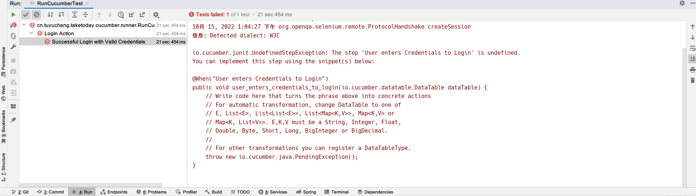

## 1. 概述

市场上的大多数商业自动化软件工具都支持某种类型的数据驱动测试，它允许使用不同的输入和验证值自动多次运行测试用例。
考虑到Selenium WebDriver更像是一个自动化测试框架，而不是一个现成的工具。在自动化测试中对数据驱动测试的支持并不完善。

这在任何自动化测试中都是经常需要的，以便通过数据或对不同的数据集再次使用相同的测试。
好的方面是，Cucumber固有地支持使用Scenario Outline的数据驱动测试。在Cucumber内部和Cucumber外部文件中使用数据插入有不同的方法。

1. Cucumber中的数据驱动测试
    + 不带Examples关键字的参数化
2. 基于Scenario Outline的Cucumber数据驱动测试
    + 带Examples关键字的参数化
    + 使用Tables进行参数化
3. 基于外部文件的Cucumber数据驱动测试
    + 使用Excel文件进行参数化
    + 使用Json进行参数化
    + 使用XML进行参数化

+ Scenario Outline：用于为两组或更多不同的测试数据集运行相同的场景。例如：在我们的场景中，如果你想注册另一个用户，你可以对同一个场景进行两次数据驱动。

+ Examples：所有Examples语句都必须在Scenario Outline部分之后指定，这包含必须传递到场景的数据。

## 2. Cucumber中的数据驱动测试

为了演示如何使用参数化测试，这里借用之前提到的登录场景：

```gherkin
Feature: Login Action

    Scenario: Successful Login with Valid Credentials
        Given User is on Home Page
        When User Navigate to Login Page
        And User enters UserName and Password
        Then Message displayed Login Successfully

    Scenario: Successful Logout
        When User Logout from the Application
        Then Message displayed Logout Successfully
```

以及对应的LoginSteps类：

```java
public class LoginSteps {
    private static WebDriver driver;

    @Before
    public static void setUp() {
        System.setProperty("webdriver.chrome.driver", "D:\\chromedriver.exe");
    }

    @Given("User is on Home Page")
    public void user_is_on_home_page() {
        driver = new ChromeDriver();
        driver.manage().timeouts().implicitlyWait(10, TimeUnit.SECONDS);
        driver.get("https://shop.demoqa.com");
    }

    @When("User Navigate to Login Page")
    public void user_navigate_to_login_page() {
        driver.findElement(By.linkText("Dismiss")).click();
        driver.findElement(By.linkText("My Account")).click();
    }

    @When("User enters UserName and Password")
    public void user_enters_user_name_and_password() {
        driver.findElement(By.id("username")).sendKeys("tuyucheng");
        driver.findElement(By.id("password")).sendKeys("tuyucheng2000@163.com");
        driver.findElement(By.name("login")).click();
    }

    @Then("Message displayed Login Successfully")
    public void message_displayed_login_successfully() {
        System.out.println("Login Successfully");
    }

    @When("User Logout from the Application")
    public void user_logout_from_the_application() {
        driver.findElement(By.xpath("//*[text()='Checkout']")).click();
    }

    @Then("Message displayed Logout Successfully")
    public void message_displayed_logout_successfully() {
        System.out.println("Logout Successfully");
    }
}
```

## 3. 不使用Examples关键字的参数化测试

我们现在的任务是参数化用户名和密码，这是很合乎逻辑的，因为两者都很可能发生变化。

在我们的Login_Test.feature文件中，我们修改传递用户名和密码的语句为以下形式：

```text
And User enters "tuyucheng" and "tuyucheng2000@163.com"
```

在上述语句中，我们从Feature文件中传递了用户名和密码，它们会自动传递给上述语句对应的Step Definition方法中。
在完成以上修改后，代码如下所示：

```gherkin
Feature: Login Action

    Scenario: Successful Login with Valid Credentials
        Given User is on Home Page
        When User Navigate to Login Page
        And User enters "tuyucheng" and "tuyucheng2000@163.com"
        Then Message displayed Login Successfully

    Scenario: Successful Logout
        When User Logout from the Application
        Then Message displayed Logout Successfully
```

还需要对Step Definition类进行更改，以使它理解Feature文件的参数化。
因此，需要更新Step Definition类中的测试步骤，该方法与上面更改的Feature文件语句相链接。代码如下：

```text
@When("User enters {string} and {string}")
```

在上述语句的帮助下，我们可以在方法的签名中声明两个形参用于接收实际的参数值：

```text
public void user_enters_user_name_and_password(String username, String password) {

}
```

最后我们在实际代码中直接使用方法的参数：

```text
driver.findElement(By.id("username")).sendKeys(username);
driver.findElement(By.id("password")).sendKeys(password);
driver.findElement(By.name("login")).click();
```

通过运行RunCucumberTest类来运行测试，我们可以看到测试成功通过。

## 4. 使用Examples关键字的参数化测试

对于不使用Examples关键字的参数化测试，它提供的数据驱动功能非常有限。因为测试可以运行多次。
但至少我们了解了数据驱动测试的结构，这里有一个技巧可以简化使用Cucumber进行数据驱动测试的过程。
Cucumber通过使用Scenario Outline和Examples部分固有地支持数据驱动测试。通过这些关键字，Cucumber允许在不需要对Java文件进行更改的情况下完成简单的数据驱动测试。

首先Examples关键字只能与Scenario Outline关键字一起使用，我们在Login_Test.feature文件中添加以下的Examples语句：

```text
Examples:
    | username   | password |
    | testuser_1 | Test@153 |
    | testuser_2 | Test@153 |
```

注意：表格必须有一个标题行，对应于Scenario Outline步骤中的变量。

Examples部分是一个表格，其中每个参数变量代表表格中的一列，用“|”分隔。
标题下的每一行表示测试用例的单独运行，以及相应的数据。因此，如果标题下方有3行，则脚本将使用其各自的数据运行3次。

我们还需要更修改Feature文件中的And语句：

```text
And User enters <username> and <password>
```

Cucumber负责解析上述语句语法，并在测试中查找Examples关键字以读取测试数据。

完整的代码如下所示：

```gherkin
Feature: Login Action

    Scenario Outline: Successful Login with Valid Credentials
        Given User is on Home Page
        When User Navigate to Login Page
        And User enters "<username>" and "<password>"
        Then Message displayed Login Successfully
        Examples:
            | username   | password |
            | testuser_1 | Test@153 |
            | testuser_2 | Test@153 |
```

对于LoginSteps类，我们无需做任何更改。当我们运行RunCucumberTest类时，我们可以看到测试成功，并且测试执行了两遍，针对于两组数据。
这使得定义大量示例、边缘情况和特殊结果变得非常容易。
变量不是硬编码测试数据，而是在Examples部分定义，并在Scenario Outline部分中使用。

**注意**：请为测试创建你自己的用户名和密码，如果你三次输入错误的用户名和密码，你的IP将被拉入黑名单。

## 5. Cucumber中的Data Tables

Cucumber中的DataTables可以以多种方式使用。DataTables也可以用于处理大量数据。它们非常强大，但不是最直观的，因为你需要处理Map的List或List的Map。
大多数人对DataTables和Scenario Outline感到困惑，但这两者的工作方式完全不同。

### 5.1 DataTables和Scenario Outline的区别

Scenario Outline：

+ 使用Examples关键字来定义场景的测试数据。
+ 适用于整个测试。
+ Cucumber自动运行完整测试的次数等于测试集中数据的数量。

DataTables：

+ 不使用关键字来定义测试数据。
+ 仅适用于在其下方定义的单个步骤。
+ 单独的代码需要理解测试数据，然后它可以运行一次或多次，但只针对单个步骤，而不是完整的测试。

正如上面所说，DataTables可以以多种方式使用，因为它提供了许多不同的使用方法，这里介绍最常用的一些。

### 5.2 使用方式

在本例中，我们将使用DataTable传递测试数据并使用asLists()方法对其进行处理。

```gherkin
Feature: Login Action

    Scenario: Successful Login with Valid Credentials
        Given User is on Home Page
        When User Navigate to Login Page
        And User enters Credentials to Login
            | tuyucheng | tuyucheng2000@163.com |
        Then Message displayed Login Successfully

    Scenario: Successful Logout
        When User Logout from the Application
        Then Message displayed Logout Successfully
```

上面的Feature文件与之前没有什么不同。唯一的区别在于，我们没有在And步骤语句中传递参数，甚至我们没有使用Examples测试数据。
我们仅在And步骤下声明了数据。所以我们使用DataTable作为Steps方法的参数。

如果你在未定义该步骤对应方法的情况下运行上述场景，控制台会显示以下错误：



将上述提示复制到LoginSteps类中并完成实现，如下所示：

```java
public class LoginSteps {

    @When("User enters Credentials to Login")
    public void user_enters_credentials_to_login(io.cucumber.datatable.DataTable dataTable) {
        List<List<String>> data = dataTable.asLists();

        // This is to get the first data of the set (First Row + First Column)
        driver.findElement(By.id("username")).sendKeys(data.get(0).get(0));

        // This is to get the first data of the set (First Row + Second Column)
        driver.findElement(By.id("password")).sendKeys(data.get(0).get(1));

        driver.findElement(By.name("login")).click();
    }
}
```

当我们运行RunCucumberTest启动测试时，可以看到测试的通过。

### 5.3 DataTable中的Maps

现在让我们看一个稍微复杂的场景，假设需要在步骤中传递大量数据。或者存在多列测试数据。你会怎么处理？答案是在DataTable中使用Map。

如果有不同的方式，可以使用DataTable中的Map，也可以为DataTable定义标题。通过Map可以使用不同的测试数据集多次执行同一步骤。

### 5.4 带标题的DataTable中的Map

在前面的例子中，我们传递了不带标题的用户名和密码，因此测试的可读性不高。
如果测试数据会有很多列怎么办。BDD测试的基本原则是使测试以业务可读的格式进行，以便业务用户能够轻松理解。
在测试数据中设置标题并不是一件多么难道事情。看看下面的场景：

```gherkin
Feature: Login Action

    Scenario: Successful Login with Valid Credentials
        Given User is on Home Page
        When User Navigate to Login Page
        And User enters Credentials to Login
            | username  | password              |
            | tuyucheng | tuyucheng2000@163.com |
        Then Message displayed Login Successfully

    Scenario: Successful Logout
        When User Logout from the Application
        Then Message displayed Logout Successfully
```

对应的，LoginSteps类中And步骤的实现需要改为以下形式：

```java
public class LoginSteps {

    @When("User enters Credentials to Login")
    public void user_enters_credentials_to_login(DataTable dataTable) {
        List<Map<String, String>> data = dataTable.asMaps(String.class, String.class);
        driver.findElement(By.id("username")).sendKeys(data.get(0).get("username"));
        driver.findElement(By.id("password")).sendKeys(data.get(0).get("password"));
        driver.findElement(By.name("login")).click();
    }
}
```

### 5.5 具有多个测试数据的DataTable中的Map

在这个测试中，我们将用户名和密码两次传递给测试步骤。所以我们的测试应该输入一次用户名和密码，点击登录按钮并再次重复相同的步骤：

```gherkin
Feature: Login Action

    Scenario: Successful Login with Valid Credentials
        Given User is on Home Page
        When User Navigate to Login Page
        And User enters Credentials to Login
            | username   | password |
            | testuser_1 | Test@153 |
            | testuser_2 | Test@154 |
        Then Message displayed Login Successfully

    Scenario: Successful Logout
        When User Logout from the Application
        Then Message displayed Logout Successfully
```

对应的，LoginSteps类中And步骤的实现需要改为以下形式：

```java
public class LoginSteps {

    @When("User enters {string} and {string}")
    public void user_enters_user_name_and_password(String username, String password) {
        for (Map<String, String> data : dataTable.asMaps()) {
            driver.findElement(By.id("username")).sendKeys(data.get("username"));
            driver.findElement(By.id("password")).sendKeys(data.get("password"));
            driver.findElement(By.name("login")).click();
        }
    }
}
```

### 5.6 将DataTable映射到对象

幸运的是，有更简单的方法来访问DataTable中的数据。例如，你可以创建一个自定义实体类并让Cucumber将表中的数据映射到这些实体类对象集合中：

```java
public class Credentials {
    private String username;
    private String password;
    // getters and setters ...
}
```

Feature文件不需要做任何改动，对应LoginSteps类中And步骤的实现需要改为以下形式：

```java
public class LoginSteps {

    @DataTableType(replaceWithEmptyString = "[blank]")
    public Credentials convert(Map<String, String> entry) {
        Credentials credentials = new Credentials();
        credentials.setUsername(entry.get("username"));
        credentials.setPassword(entry.get("password"));
        return credentials;
    }

    @When("User enters Credentials to Login")
    public void user_enters_credentials_to_login(List<Credentials> credentialsList) {
        for (Credentials credentials : credentialsList) {
            driver.findElement(By.id("username")).sendKeys(credentials.getUsername());
            driver.findElement(By.id("password")).sendKeys(credentials.getPassword());
            driver.findElement(By.name("login")).click();
        }
    }
}
```