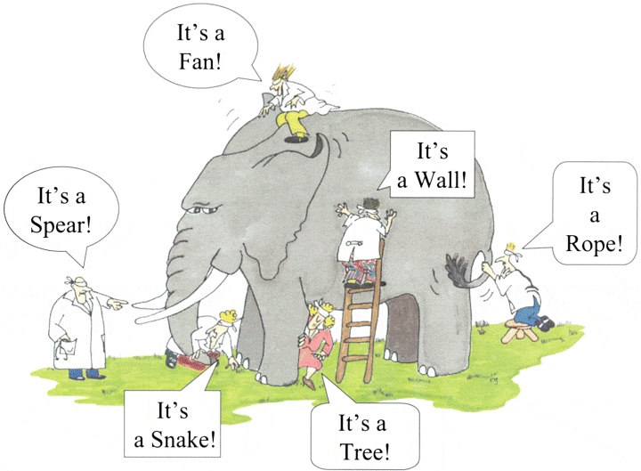

## 1. 概述

行为驱动测试是TDD的扩展，就像TDD一样，我们首先编写测试并添加应用程序代码。在这里两者的主要区别是：

+ 测试采用简单的描述性英语语法编写。
+ 测试被解释为应用程序的行为，更加以用户为中心。
+ 用例子来阐明需求。

这种差异随之带来的是需要一种能够以可理解的格式进行定义的语言。

## 2. BDD的特点

1. 从“测试”思维到“行为”思维的转变。
2. 业务涉众(利益相关者)、业务分析师、QA团队和开发人员之间的协作。
3. 无处不在的语言，很容易描述。
4. 由业务价值驱动。
5. 通过使用非技术涉众可以理解的自然语言扩展测试驱动开发(TDD)。
6. 像Cucumber或JBehave这样的BDD框架是一种促成因素，充当业务和技术语言之间的“桥梁”。

BDD是受欢迎的，可以用于单元测试用例和UI测试用例。像RSpec(用于Ruby)或.net中的MSpec或SpecUnit这样的工具在遵循BDD方法的单元测试中很流行。或者，你可以编写关于UI交互的BDD风格的规范。假设你正在构建一个web应用程序，你可能会使用像WatiR/WatiN或Selenium这样的浏览器自动化库，并使用上面提到的其中一个框架或一个given/when/then工具(如Cucumber(用于Ruby)或SpecFlow(用于.net))编写脚本。

## 3. BDD工具Cucumber

Cucumber是一个支持行为驱动开发(BDD)的测试框架。它允许我们使用一种叫做Gherkin的语言定义的简单语法，在简单有意义的英语文本中定义应用程序行为。Cucumber本身是用Ruby编写的，但它可以用来“测试”用Ruby或其他语言编写的代码，包括但不限于Java、C#和Python。

## 4. 为什么选择BDD框架？

假设有一个客户要求电子商务网站通过在网站上实现一些新功能来增加产品的销量。开发团队的唯一挑战是将客户的想法转化为能够真正为客户带来好处的东西。

最初的这个想法非常棒，但这里唯一的挑战是，开发这个想法的人不是拥有这个想法的人。如果提出这个想法的人恰好是一个有才华的软件开发人员，那么我们可能会很幸运：这个想法可以被转化成可用的软件，而不需要向任何其他人解释。但现在，这个想法需要与他人沟通，并且必须从业务所有者(客户端)传递到开发团队或其他许多人。

大多数软件项目都涉及到几个人组成的团队一起协作，因此高质量的沟通对他们的成功至关重要。你可能知道，良好的沟通不仅仅是向他人雄辩地描述你的想法；你还需要征求反馈意见，以确保你的想法被正确理解。这就是为什么敏捷软件团队学会了以小增量的方式工作，使用增量构建的软件作为对涉众的反馈：“**这是你所说的意思吗**?”

下图是一个例子，展示了客户的想法，以及他们与开发团队的沟通，以及开发人员是如何理解和处理它的。



在Gherkin语言的帮助下，Cucumber有助于在团队中发现和使用普遍存在的语言。使用Cucumber编写的测试直接与开发代码交互，但是测试是用业务涉众非常容易理解的语言编写的。Cucumber测试在代码中产生任何歧义之前就消除了许多误解。

## 5. Cucumber/SpecFlow/BDD测试示例

Cucumber的主要特点是它注重验收测试，使得团队中的任何人都可以轻松地阅读和编写测试，并且通过这个功能，它将业务用户引入到测试过程中，帮助团队探索和理解需求。

```gherkin
Feature: Sign up
    Sign up should be quick and friendly.

    Scenario: Successful sign-up
    New users should get a confirmation email and be greeted personally by the site once signed in.
        Given I have chosen to sign up
        When I sign up with valid details
        Then I should receive a confirmation email
        And I should see a personalized greeting message

    Scenario: Duplicate email
    Where someone tries to create an account for an email address that already exists.
        Given I have chosen to sign up
        But I enter an email address that has already registered
        Then I should be told that the email is already registered
        And I should be offered the option to recover my password
```

我们看一下上面的示例代码，任何人都可以理解测试的处理过程和它的目的。它通过让人们在系统构建之前对其进行可视化，产生了意想不到的强大影响。任何业务用户都会阅读并理解测试，并能够给你反馈，以确定测试是否反映了他们对系统应该做什么的理解，它甚至可以引导你思考需要考虑的其他场景。

## 6. 什么是Gherkin-BDD语言？

在深入研究Gherkin之前，有必要了解跨项目不同领域使用通用语言的重要性和必要性。不同的领域在这里指的是客户、开发人员、测试人员、业务分析师和管理团队。让我们先讨论开发项目的常见问题，然后再讨论解决方案，在此过程中我们会遇到对通用语言的需求。

假设你是一个技术团队(开发人员和测试人员)的一员，并且你有一个与业务团队(业务所有者和业务分析师)合作的任务。你必须提出你项目的需求，这些需求将是你的开发团队将实现和测试团队将测试的。此外，你必须在你的电子商务平台上做一个小的搜索功能，这个功能允许用户在你的网站上搜索产品。

在我们的经历中，我们都可能遇到过业务团队提出的要求是非常粗糙和基本的。例如，在这个场景中，我们可能会得到以下需求：

+ 功能要求
    + 搜索功能
        + 用户应该能够搜索产品
        + 只显示与搜索字符串相关的产品

### 6.1 上述需求引出的问题

正如我们看到的，这些需求是有用的并且可寻的，但并不准确。它们描述了系统的广泛行为，但没有指定系统的具体行为。让我们通过剖析第一个需求来说明它，第一个需求说用户应该能够搜索产品，但它没有指定以下内容：

+ 搜索字符串的最大长度可以是多少？
+ 如果用户搜索一个无效的产品，搜索结果应该是什么？
+ 可以用来搜索的有效字符是什么？

类似地，还有应用程序的一些更详细的行为。

通常在一个项目中，我们最终会向业务团队提出上述问题，并得到答复，大多数答复最终会落于项目文档中，但不幸的是，那些答复可能会丢失在电子邮件和电话交谈中。此外，这些答复也可以加以解释，例如：

+ **问业务负责人**: 如果用户搜索一个无效的产品，搜索结果应该是什么？
+ **业务负责人回复**：无效的产品搜索应该在搜索页面上显示以下文本：**未找到产品**。

### 6.2 问题的答案会导致更多的疑问和解释

我们从业务团队那里得到了问题的答案，但仍然会有以下的疑问：

+ 无效产品的定义是不明确的，不同的团队成员会以不同的方式解释它。某个人可能会认为无效产品是没有出现在库存中的产品，而另一个团队成员可能会认为无效产品是拼写错误的产品。
+ 业务团队的回答是“未找到产品”的文本应该显示在页面上。它是否表示应该为用户提供一个新的搜索选项？或者是否应该为用户显示相关/类似的搜索选项？

这些正是系统中可能会引入错误的地方。另外，如果我们分析第二个疑问，我们会发现用户业务团队希望向用户提供一个新的搜索选项和相关/类似的搜索选项。然而，当被问到这个问题时，他们没有想到这种情况。因此，在上面的例子中所发生的是：

1. 业务团队和技术团队在两个不同的层次上进行沟通，业务团队是模糊的，而技术团队是准确的。
2. 系统中引入了模糊性，这里是“无效产品”的定义。
3. 没有给业务团队足够的洞察力，这样他们就可以想出新的场景。
4. 项目的一些细节在邮件和电话交谈中丢失了。

### 6.3 如何提高需求？

现在，让我们改进业务团队给出的第一个需求，并努力使其更准确：

> 当用户通过一个没有拼写错误的产品名称搜索库存中的产品时，所有名称相近的产品都应该展示出来。

> 当用户通过一个没有拼写错误的产品名称搜索库存中的产品时，搜索结果应该首先展示精确匹配，然后展示相似匹配。

在这里，我们可以看到需求变得更清晰，有了这些明确的需求，我们能够更多地考虑系统。例如在第二个要求的情况下，在阅读它之后，我们可能会想到其他的场景：

+ 如果没有精确和相似的匹配，应该怎么做？
+ 是否应该给用户一个错误消息？
+ 或者用户收到一条消息，说明产品预计何时到达库存。

### 6.4 我们实现了什么？

我们已经迫使客户从细节方面考虑问题。有了这种改进的思维方式，业务团队就会提出更精细的需求。这反过来又减少了项目中的模糊性，并通过减少错误实现的数量使开发人员和测试人员的工作变得更轻松。另外，你可以看到现在，每个需求都记录了应用程序的一个确切行为。这意味着它本身可以被认为是一个需求文档。

### 6.5 结论是什么？

通过上面的例子，我们可以得出以下结论：

1. 项目中的不同团队需要一种通用语言来表达需求，这种语言应该足够简单，能够被业务团队成员理解。并且应该足够明确，能够为开发人员和测试人员消除大部分的歧义。
2. 这种语言应该打开团队成员的思维，让他们想出更多的场景。当你表达更多的细节时，你会尝试更多地分析系统，因此你最终会制定更多的用户场景。
3. 这种语言应该足够好，可以用作项目文档。

为了解决这些问题，Gherkin应运而生。Gherkin是一种简单、轻量级和结构化的语言，它使用常规的口语来描述需求和场景。我们所说的常规口语是指英语等其他大约30多种语言。

## 7. Gherkin例子

由于Gherkin是一种结构化语言，它遵循一些语法，让我们先来看看在Gherkin中描述的一个简单场景：

```gherkin
Feature: Search feature for users This feature is very important because it will allow users to filter products

    Scenario: When a user searches, without spelling mistake, for a product name present in inventory.
    All the products with similar name should be displayed
        Given User is on the main page of www.myshopingsite.com
        When User searches for laptops
        Then search page should be updated with the lists of laptops
```

## 8. 总结

Gherkin包含一组关键字，这些关键字定义了场景的不同前提。正如我们在上面看到的，彩色部分是关键字。

这里需要注意的要点是：

+ 测试是用通俗易懂的英语编写的，这对项目团队的所有领域都是通用的。
+ 该测试的结构使其能够以自动的方式读取，在描述场景的同时创建自动化测试。